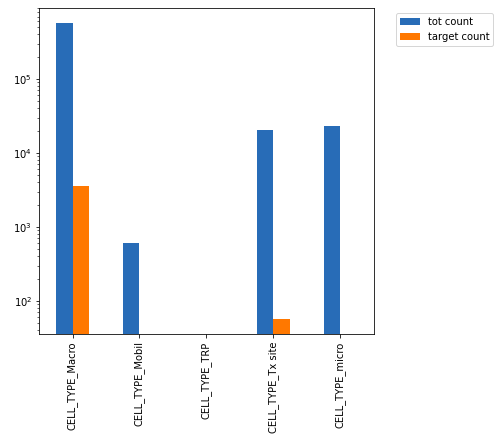
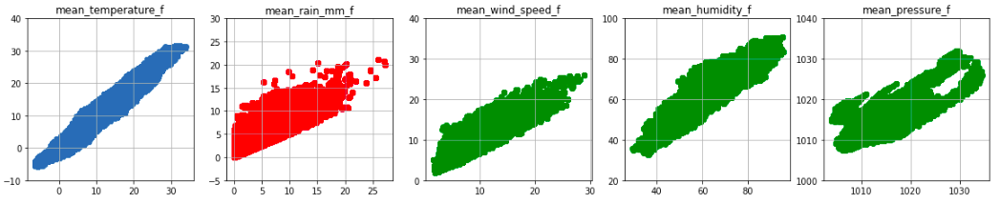
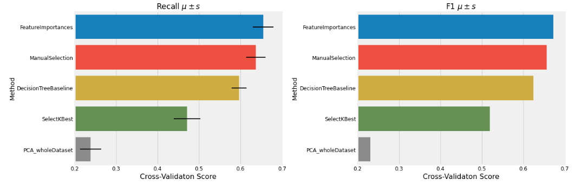

# data-mining-and-text-mining-challenge

This repository contains the final project of the course [Data Mining and Text Mining](https://www11.ceda.polimi.it/schedaincarico/schedaincarico/controller/scheda_pubblica/SchedaPublic.do?&evn_default=evento&c_classe=691572&polij_device_category=DESKTOP&__pj0=0&__pj1=17f53de47fb15c45b12fba90714f19a6) offered at Politecnico di Milano in the academic year 2020-2021.

## Introduction 

This report is aimed at explaining the methodology that was chosen to analyze and do the classification based on Predictive Maintenance data set for prediction of faults on air conditioning equipment installed mobile network transition site in a 14-days forecast window. Available information is related to weather conditions (past and forecast), alarms and faults occurred on site, statistic features of the site. Generally, we have 621299 number of observations and 136 features for two years (2019-2020) time intervals which in each date there are set of observation falling and the class target(aircon_sum_wo_target_next_14d) is binary values of 0 and 1 which shows the presence of a fault in the following 14 days.

## Data Analysis and Visualization
[1-Preprocessing.ipynb](https://github.com/fulcus/data-mining-and-text-mining-challenge/blob/master/1-Preprocessing.ipynb)

In the first phase we explored the dataset and its structure visualizing the attributes and studying their values’ distribution and correlation.

We immediately noticed that there were no missing values, but the inconsistencies were more subtle.
The biggest challenge of the task was the high dimensionality of the data, which was clear right away. This implied that we can’t plot all attributes and study each of them individually, so we found commonalities among the attributes, namely we studied categorical data and temporal data separately.

#### Categorical Data
We found out that CELL_TYPE had a very unbalanced distribution, with 92% of the samples belonging to the Macro type, and none to TRP, that we dropped as it was a constant column. Moreover, none of the faulty sites belonged to the Mobil or Tx cell category.
Another inconsistency we found and removed were the 4500 cells that did not have any cell type.
GEOGRAPHICAL_CLUSTERS were more balanced, for number of samples and number of faulty sites per category.
We also transformed these, which were originally one hot encoded into categorical variables. This reduced the dimensionality of our dataset and improved the performance of our model.

#### Temporal Data
The data about alarms and weather had one main commonality, i.e. they are related to a specific time period, in the past or the future, of different lengths: 14, 7 or 3 days. 
This made these attributes overlap significantly. We leveraged this property by checking if the values of such attributes are consistent with each other, in particular we checked if the min and max values of the shorter time periods are contained in the longer period, which they mostly are.
For the persistence attributes, that represent the minutes that the alarm rang in the specified time period, we dropped the rows that had a value greater than the number of minutes possible for that time period.

We then visualized the correlation among attributes with a correlation matrix, and noticed that two submatrices emerged, one pertaining to the weather and one to the alarms. We used scatter plots to better visualize the couples of attributes that had a high correlation. Plotting these variables gave us valuable insights that allowed us to remove attributes that we deemed redundant in the feature selection phase. In particular we saw a high correlation among overlapping time periods across all attributes, e.g. fire/smoke_sum_alarms_prev7d and fire/smoke_sum_alarms_prev14d.

### Discretization

[2-Discretization.ipynb](https://github.com/fulcus/data-mining-and-text-mining-challenge/blob/master/2-Discretization.ipynb)

Before finding the most performant classifier and doing any feature selection, we applied discretization for all the variables concerning the weather, this was done to take into account the intrinsic imprecision of the measurements and provides more consistent training data to our model. For instance, a temperature of 1 or 3 degree isn’t a big change but our model might be misled by it. As a result, we mapped all weather attributes in 5 ordinal bins from 0 to 4 to represent growing degrees of intensity [low, mid_low, mid, mid-high, high]. We tried different discretization techniques and obtained the following results:

|Discretization type | Recall_Mean | Recall_Std | F1_Mean | F1_Std
|:---|---|---|---|---|
|No Discretization | 0.60  | 0.02 | 0.63 | 0.02
|Ordinal-Equal-Width | 0.66  | 0.03  | 0.67 | 0.02
|Ordinal-Equal-Frequency | 0.65  | 0.02 | 0.66 | 0.01
|Ordinal-Equal-kMeans | 0.64  | 0.03 | 0.65 | 0.02

This was all done using 10-fold cross-validation on a DecisionTree as a baseline.

From the above results we saw that Ordinal-Equal-Width was performing best so we chose it and transformed our original data to continue our model selection. This preprocessing of data improved our baseline, since Decision Trees are less biased towards discretized values. Moreover we discarded the 1-Hot-Encoding Discretization in advance because of the high dimensionality that could generate the operation.

## Data Processing
### Feature selection

[3-Feature_selection.ipynb](https://github.com/fulcus/data-mining-and-text-mining-challenge/blob/master/3-Feature_selection.ipynb)

Initially the first step was to apply the simplest way to perform classification, which is Majority voting. In our problem we have a really unbalanced dataset with only 0.6% of the data points that have been classified as faulty. That brings us to consider other metrics of evaluation like precision, recall and F1 score, instead of accuracy.
In the second step we had to select a reasonable classifier to start with as a baseline model.
We selected the most suitable one and discarded:
* **LogisticRegression**: requires categorical variables to be One-Hot encoded. Since we already have high dimensionality, it would lead to the creation of a very large sparse matrix, which will slow down the training and harm the overall performance of the model.
* **k-NN**: it is subject to the curse of dimensionality, is computationally expensive (scan of whole database) and assumes attributes are equally important (not our case).
* **Naive Bayes, Bayesian Belief Networks**: Since this model assumes attributes are equally important and statistically independent, we cannot choose this model for our type of problem.

Since we have high dimensional dataset and also a high correlation between features we decided to use DecisionTree. To improve the performance on our validation-set we tried to apply a post-pruning technique without any success. In fact, we observed that pruning the tree would have led to worse performances. This was surely correlated to high dimensionality. Thus, feature selection has been applied.
Different methods has been applied:
* **Selection by manual inspection**: Looking at the correlation matrix of the attributes we saw high correlated features and some features data points already contained in others. For instance, all mean/max/min_w_prev3d are contained in mean/max/min_w_prev7d and mean/max/min_w_f_next7d are contained in mean/max/min_w_f_next14d and the averages 
over a long period are more smooth and get less variations.
* **Select K-Best**: given k = 50 as input, returned the 50 most high scored variables in the dataset based on the f_class score that represents how well a feature discriminates between the two classes.
* **Feature importances**: given 3 main algorithms to look for the feature_importance like Ada_Boost, Random_Forest, Decision_Trees. We took the first 20 most common valuable variables.
* **PCA**: first normalizing the data, by applying z-score normalization, we applied PCA with 50 components, which explained the 96% of the variance of our data. 

This plot shows the cross-validation score F1 and Recall for the 4 methods described before and for our baseline. We certified these results by applying Statistical t-test on the top 3 with confidence = 0.95. We found out that the difference between FeatureImportances and ManualSelection methods is not statistically significant. Thus, we chose to train our model with both and preserve the best performances.

## Model and Predictions

[6-Predictions.ipynb](https://github.com/fulcus/data-mining-and-text-mining-challenge/blob/master/6-Predictions.ipynb)

The Decision Tree had a good performance as baseline. Then, we decided to use the Random Forest algorithm since it could improve our baseline results. This is because this ensemble method has uncorrelated and unpruned trees and doesn’t lose generalization. Through hyperparameters tuning we found that the combination that allows us to get the highest performance is:

* Number of estimators = 250
* Max depth =  40
* Min leaf sample = 5

Since our dataset was heavily unbalanced, we also performed oversampling in order to create more samples belonging to the minority class.  This has slightly improved our performance. With the previously mentioned values of the hyper parameters, we had a Recall = 0.825, a Precision = 0.731 and F1 = 0.775, Weighted Recall = 0.85. Since our goal was to predict faults, we chose one of the configurations that led us to a recall score higher than precision. We made this choice because we would like to have a probability of predicting faulty sites as high as possible, obviously without assigning every test sample to 1. About test predictions, we want to highlight that we did some data processing similar to the one done in the dataset. Nevertheless, since in the test we saw that there were some inconsistent values, we imputed them from other valid test samples.

## Team
[Francesco Fulco Gonzales](https://github.com/fulcus), [Francesco Govigli](https://github.com/FrancescoGovigli), [Alberto Latino](https://github.com/albertolatino)
